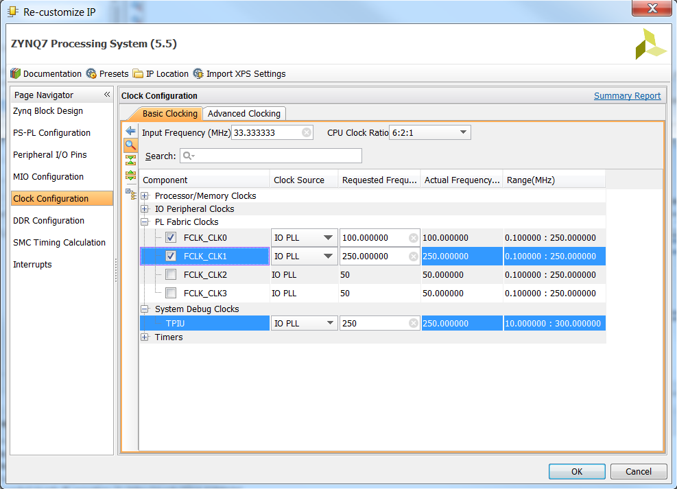
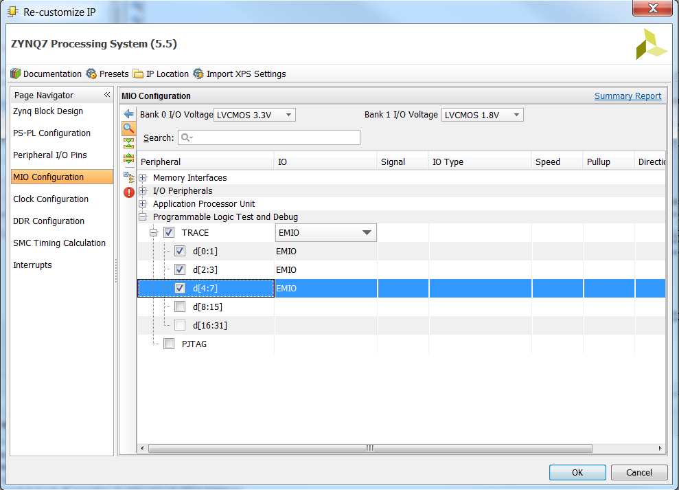

# Notes sur la manipulation des composants Coresight
Concernant la partie logicielle, c'est normalement au point dans un contexte Yocto dans mon tutoriel sur Github: https://pcotret.github.io/coresight-zedboard/
## Dépôts logiciels
1. https://bitbucket.org/hardblare/hardware-assisted-static-instrumentation
2. https://bitbucket.org/hardblare/hardblare-codes

## Dépôt 1
Dans ce dépôt, il y a un exemple d'ajout de syscall dans le noyau Linux puis la compilation du noyau dans un contexte Yocto:
```bash
bitbake linux-xlnx  
bitbake linux-xlnx -c compile -f && bitbake linux-xlnx -c deploy
```
- Les lignes de commande sont conformes à ce que j'ai fait par ailleurs dans la partie logicielle

Sinon, il y a également un design matériel associé. Ca devrait permettre de vérifier quelles sont les propriétés du bloc Zynq à prendre en compte.

## Dépôt 2
Yocto utilise le noyau Linux disponible ici : https://github.com/Xilinx/linux-xlnx. Il faudrait vérifier si les patchs Linux y sont présents.
- Les `hardware-designs` contient également des projets Vivado qui peuvent être intéressants concernant la configuration du Zynq.
- Le PFT decoder n'est pas inintéressant et extrait de l'Android Open Source Project. Ca contient un PFT decoder qui analyse des traces pré-existantes. Je vais le reprendre proprement et en faire un dépôt gitlab.inria.fr

Le fichier `patches.md` contient le diff des patchs qui ont été utilisés pour Coresight :
- `drivers/hwtracing/coresight/coresight-etm3x-sysfs.c` et `drivers/hwtracing/coresight/coresight-etm.h` : l'activation du branch broadcasting.
- `arch/arm/boot/dts/zynq-7000.dtsi`: l'ajout des différents composants Coresight.
- `drivers/hwtracing/coresight/coresight-tpiu.c`: l'ajout des registres du TPIU.

## Manipulation

Même après les manipulations logicielles détaillées dans le blogpost https://pcotret.github.io/coresight-zedboard/, on en reste au même point...

D'après une doc cachée au fond d'un dépôt :

>To activate coresight components in the Zynq under vivado processing system IP, activate trace by choosing a trace width and deciding where to connect these traces (either to EMIO or MIO). If the connection is made to EMIO (Figure 3.14), it is a wire available to the PL part of ZYNQ and if the connection is made to MIO, it is available to the output ports and can be used and analysed by logic analyzers. A clock is needed by TPIU that allows to synchronize TPIU with trace analyzer. By looking at ARM Coresight Component User guide, two frequencies can be choosed (Figure 2.6).
>1. @250 MHz : data should be received only at front end.
>2. @125 MHz : data should be received at both ends. The frequency of 250 MHz was chosen because working with dual edge is not easy and it is not adapted to Zynq FPGA. Dual edge clock can be used in CPLD’s (like Xilinx’s CoolRunner II which offers the possibility of using dual edge FF’s).





L'idée serait dans un premier temps de tester cette manipulation, de regénérer un `boot.bin` avec `bootgen` et surtout de retrouver la documentation Coresight où cette information d'activation du TPIU apparait...