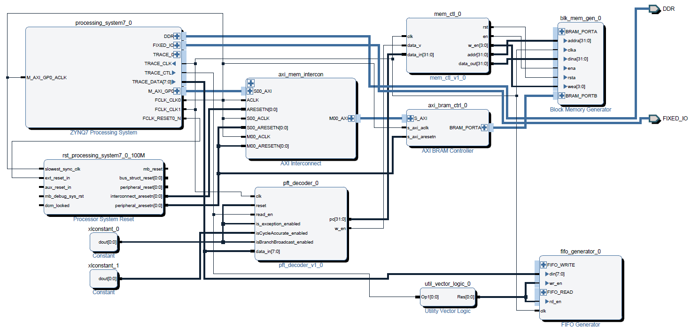

# Tutorial Tracing 
## Muhammad Abdul WAHAB
### 19/01/2018
#### Updated: 28/05/2019

To follow this tutorial, you will require a SD card, a zedboard and a SD card writer. 

## Attached file content

A zip file is provided with this tutorial. By unzipping, you will get the following files. Two more files welcome and passwd are also required to be created.

| File Name        | Description                              |
| ---------------- | ---------------------------------------- |
| boot_image.zip   | All files to copy in partition 1 of SD card. |
| RootFS.tar.gz    | Example file system used for development in [HardBlare](http://www.hardblare.cominlabs.ueb.eu/fr/presentation) project. |
| decoder_bram.bit | bitstream to program the FPGA.           |
| program.elf      | simple program to trace.                 |
| program.objdump  | disassembly of program.elf obtained using `objdump -d`. |
| trace_bram.elf   | Application that reads the BRAM to get the decoded trace. |
| script.sh        | script that will take care of configuring CoreSight components using TPIU as sink, programming FPGA and recovering the trace. |
| script_etb.sh    | script that will take care of configuring CoreSight components using ETB as sink, programming FPGA and recovering the trace. |
| ptm_decode.c     | C code that decodes PFT trace packet. |
| ptm_decode.o     | Binary corresponding to the PTM decoder. |

## Hardware design

The hardware design is shown in figure below. It is implemented in Vivado 2017.1. You don't need to implement it. It is shown to better understand that the recovered trace is decoded. 



## Prepare SD Card
You can follow the [link](http://www.embeddedforu.com/embedded-linux/how-prepare-a-bootable-sd-card-emmc-using-linux-commands/) to partition your SD card. It should have two partitions as: 
1. Partition 1 (usually named BOOT) contains the content of boot_image.zip 
2. Parition 2 RootFS contains the file system for kernel. It can be obtained by decompressing RootFS.tar.gz. The attached RootFS image should remain internal. But, it can be replaced by any image for zedboard found on the internet. 

    tar xvzf RootFS.tar.gz -C /dev/sdX2

Replace sdX by the letter for your SD card. (e.g. sdb if your sd card is mounted as /dev/sdb).

## Boot Kernel

**Use root as login. There is no password.**

When you boot the kernel, you should make sure that CoreSight components are recognized. To check this run the following command : 

    dmesg | grep coresight 

You should see the below lines saying that the CoreSight PTM components have been initialized. 

    [    1.277964] coresight-etm3x f889c000.ptm0: PTM 1.0 initialized
    [    1.284261] coresight-etm3x f889d000.ptm1: PTM 1.0 initialized

Once the kernel is booted, you can run the script to trace your program. 
If we want to trace program main function only, we need to get its start and stop addresses. It can be done by disassembling the binary and looking the file. 

    objdump -d program.elf > program.objdump
    vi program.objdump

Here is how the file looks like    

    00008608 <main>:
        8608:   e52de004    push    {lr}        ; (str lr, [sp, #-4]!)
        860c:   e24dd01c    sub sp, sp, #28
        8610:   ebffff9a    bl  8480 <geteuid@plt>
        8614:   e1a03000    mov r3, r0
        8618:   e3530000    cmp r3, #0
        861c:   0a00000a    beq 864c <main+0x44>
        8620:   e3080730    movw    r0, #34608  ; 0x8730
        8624:   e3400000    movt    r0, #0
        8628:   e3081738    movw    r1, #34616  ; 0x8738
        862c:   e3401000    movt    r1, #0
        8630:   ebffff8f    bl  8474 <fopen@plt>
        8634:   e58d0014    str r0, [sp, #20]
        8638:   e59d3014    ldr r3, [sp, #20]
        863c:   e3530000    cmp r3, #0
        8640:   1a00000c    bne 8678 <main+0x70>
        8644:   e3a00001    mov r0, #1
        8648:   ebffff98    bl  84b0 <exit@plt>
        864c:   e308073c    movw    r0, #34620  ; 0x873c
        8650:   e3400000    movt    r0, #0
        8654:   e3081738    movw    r1, #34616  ; 0x8738
        8658:   e3401000    movt    r1, #0
        865c:   ebffff84    bl  8474 <fopen@plt>
        8660:   e58d0014    str r0, [sp, #20]
        8664:   e59d3014    ldr r3, [sp, #20]
        8668:   e3530000    cmp r3, #0
        866c:   1a000001    bne 8678 <main+0x70>
        8670:   e3a00001    mov r0, #1
        8674:   ebffff8d    bl  84b0 <exit@plt>
        8678:   e1a0300d    mov r3, sp
        867c:   e1a00003    mov r0, r3
        8680:   e3a01001    mov r1, #1
        8684:   e3a02014    mov r2, #20
        8688:   e59d3014    ldr r3, [sp, #20]
        868c:   ebffff7e    bl  848c <fread@plt>
        8690:   e59d0014    ldr r0, [sp, #20]
        8694:   ebffff88    bl  84bc <fclose@plt>
        8698:   e1a0300d    mov r3, sp
        869c:   e3080744    movw    r0, #34628  ; 0x8744
        86a0:   e3400000    movt    r0, #0
        86a4:   e1a01003    mov r1, r3
        86a8:   ebffff6e    bl  8468 <printf@plt>
        86ac:   e3a03000    mov r3, #0
        86b0:   e1a00003    mov r0, r3
        86b4:   e28dd01c    add sp, sp, #28
        86b8:   e49df004    pop {pc}        ; (ldr pc, [sp], #4)


Note these addresses. For the program.elf file provided, these addresses are : 8608 and 86b8. They are used in the script.

    cd /home/root # cd ~
    mkdir test && cd test
    cp ../script.sh .
    cp ../program.elf .
    cd ../    
    chmod +x script.sh
    ./script.sh

You can look at the trace by reading decoded_trace.txt file created in the same folder.

    cat decoded_trace.txt
    /dev/mem opened.
    Memory mapped at address 0xb6f3d000.
    00 8608 8480 8614 864c 8474 8660 8678 848c 8690 84bc 8698 8468 86ac b6da2cf8 b6da2c00  
    00 00 00 00 00 00 00 00 00 00 00 00 00 00 00 00  

Have a look at the program, you will notice that for each branch, the branch address is in the trace. Furthermore, for each BL instruction, you have the return address.


# ETB tracing and decoding

The raw trace can be recovered from the ETB without using the FPGA part. 

Using script_etb.sh, a raw trace binary file can be recovered which can be decoded using the ptm_decode.o binary file. 

# convert raw trace text to binary file

```bash
xxd -r -p trace.txt > trace.bin
```

# use ptm decoder to obtain decoded trace

Run the following command to obtain decoded trace. Please adapt the file name (input option).

```bash
./ptm_decode.o --pft-1.1 --cycle-accurate 0 --print-input --contextid-bytes 0 --input trace.bin --print-config > trace.decoded
```

The options used for this binary are explained below. 

- **pft-1.1** indicates the version of the PFT protocol used. 
- **cycle-accurate** indicates the cycle accurate feature provided by PTM. As it is not needed in our case, we turn it off by providing the value "0".
- **print-input** prints the raw trace before the decoded trace packet. 
- **contextid-bytes** show the context id of an application if the option has been enabled in the trace.
- **input** provides the input file in bin format. 
- **print-config** prints the configuration used to decode trace. 

The decoded trace can be found in the trace.decoded file. The ANSI escape options must be used in an editor to visualize the colored decoded trace :)
